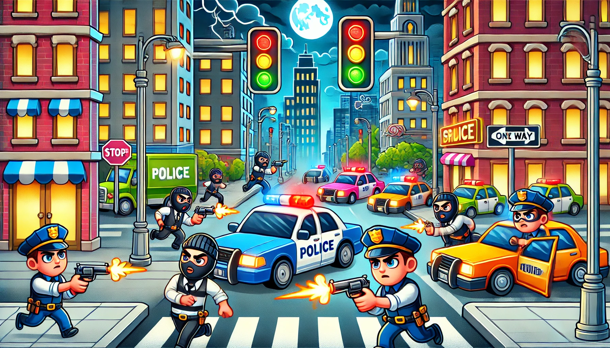

# Shooting Game Model Concept

This repository contains a simplified SysML v2 concept model for a basic shooting game. The model outlines core gameplay interactions between the `Player`, `Weapon`, and `Target`, serving as a foundation for testing essential game mechanics before full-scale implementation. 

## Overview

The `Shooting Game POC Model` demonstrates the basic interactions required in a shooting game:
- A `Player` who can initiate firing actions.
- A `Weapon` with limited ammunition that tracks each shot.
- A `Target` with health that decreases upon each successful hit.

The model establishes fundamental interactions without complex behavior or advanced game logic, focusing instead on proof-of-concept functionality to verify the following:
1. **Triggering the Weapon**: Ensures that the player can activate the weapon to fire bullets.
2. **Ammo Management**: Implements simple ammunition tracking, where the weapon’s ammo count decreases with each shot.
3. **Hit Detection and Health Reduction**: Checks for successful hits on the target, reducing the target's health when hit.

## Model Components

### GameEnvironment
- The main environment containing the `Player`, `Weapon`, and `Target`.
- Defines the connections between components to facilitate shooting and hit detection.

### Player
- Contains the action `triggerFire`, representing the player’s ability to initiate a firing action.
- Directly connected to the `Weapon` through the `PlayerWeaponConnection` interface, allowing control over the weapon's firing sequence.

### Weapon
- Tracks remaining `ammo` (initially set to 5).
- Contains the action `trigger`, which initiates the firing sequence if ammo is available.
- The `reduceAmmo` action reduces the ammo count by 1 each time a shot is fired.
- The `bullet` part represents the projectile fired toward the `Target`.

### Target
- Tracks `health` (initially set to 30).
- Contains a `hitArea`, representing the part of the target that can be hit by bullets.
- The `reduceHealth` action reduces the target's health by 5 upon each successful hit.
  
### Interfaces
- **PlayerWeaponConnection**: Connects the `Player`’s `triggerFire` action to the `Weapon`’s `trigger` action, allowing the player to fire the weapon.
- **HitDetection**: Connects the `Weapon`’s `bullet` to the `Target`’s `hitArea`, allowing hit detection for the target when a bullet reaches the designated area.

## Use Cases

The primary use case for this POC is to validate the interactions between the `Player`, `Weapon`, and `Target`. The model demonstrates:
1. **Firing Mechanism**: The player can initiate firing through `triggerFire`, which activates the weapon’s `trigger` action.
2. **Ammunition Control**: The weapon will only fire if it has ammo, and the `reduceAmmo` action decrements ammo with each shot.
3. **Target Hit Response**: If the weapon’s bullet intersects with the target's `hitArea`, the target’s `health` decreases via `reduceHealth`.

## Future Extensions

This proof of concept can be expanded in the following ways:
- **Enhanced Ammo Replenishment**: Adding a mechanism to reload ammo.
- **Advanced Target Behavior**: Introducing multiple targets or targets with varied health responses.
- **Player Health and Scoring**: Tracking player health and implementing a scoring system based on successful hits.

## Getting Started

To utilize this model:
1. Load the SysML v2 model into a SysML-compatible modeling environment.
2. Run simulations or validations to verify each interaction (firing, ammo management, hit detection).
3. Use this model as a foundation for building more complex game mechanics.