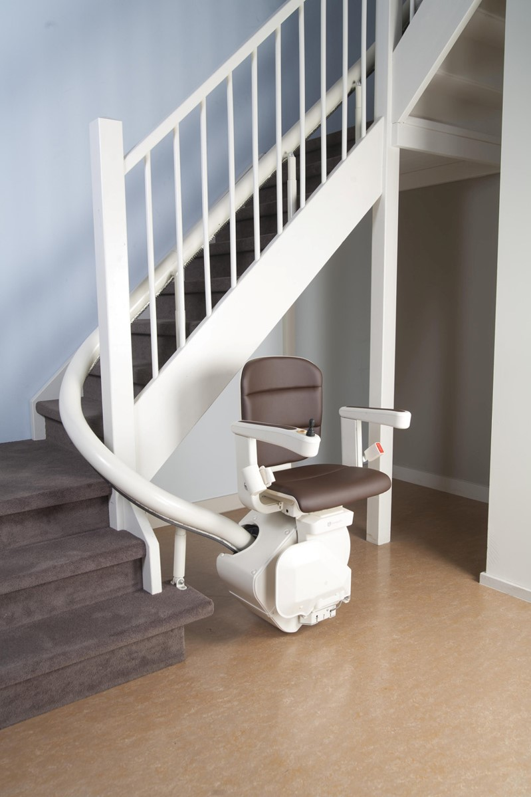

# Lift Chair System Model

The Lift Chair System is a detailed SysML v2 model developed to assist individuals with reduced mobility, enabling them to navigate stairs safely and comfortably within their own homes. This model represents a highly reliable and user-friendly assistive technology designed for elderly users or those with physical limitations who wish to maintain independence in multi-level living environments. The system’s core components include the Stannah Control Panel for intuitive operation, the Linak LA31 motor for smooth and controlled lifting, and the Mean Well HLG-150H-24A power supply, which ensures consistent and safe power delivery to the motorized mechanisms.

Functionality-wise, the lift chair features multiple essential and safety-focused operations. Users can control the chair using simple commands from the control panel, such as "lift," "lower," and "stop," with the motor executing these commands with precision and stability. The model also incorporates advanced safety mechanisms, like obstacle detection sensors and an emergency stop relay, to immediately halt operations in the event of an issue, preventing any harm to the user. The guide rail system ensures that the chair follows a smooth path along the stairs, while the integrated safety controllers actively monitor for potential risks, making the system not only functional but also exceedingly secure and dependable for everyday use.

Here are some revelant prompts for the research of PoC:
•  Prompt 1: "Peux-tu me donner quelques PoC pour le ControlPanel et le moteur ?"
•  Prompt 2: "Par PoC j'entends des éléments déjà existants qui pourraient correspondre à mon projet"
•  Prompt 3: "Et y a-t-il des composants déjà produits par des entreprises qui pourraient correspondre à mes besoins ?"
•  Prompt 4: "Peux-tu m'en proposer d'autres ?"
•  Prompt 5: "Peux-tu me donner un exemple précis de capteur ?"
•  Prompt 6: "Peux-tu me donner des contrôleurs que je pourrais utiliser pour arrêter directement le système en cas de problème ?"
