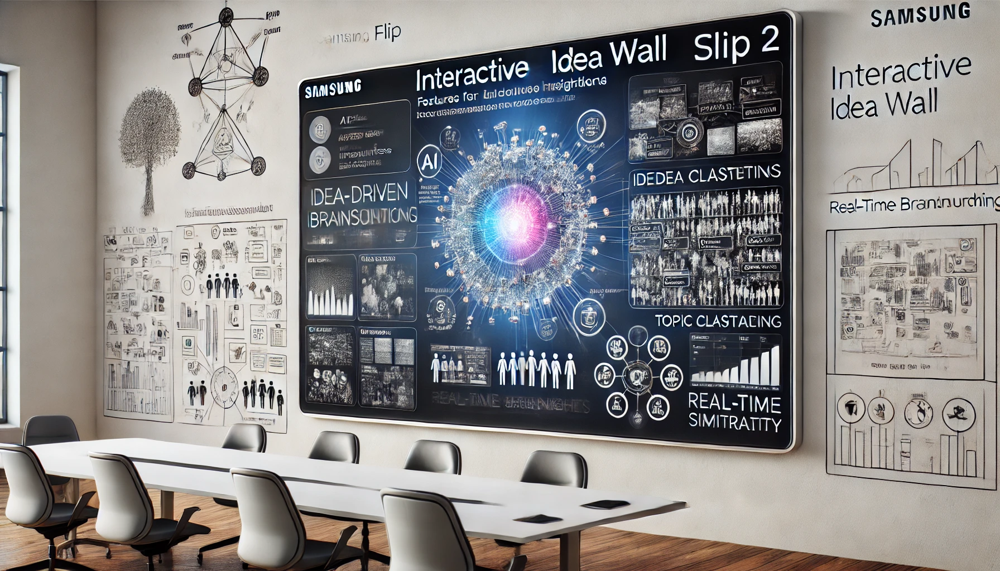

# Interactive Idea Wall System Model: Collaborative and AI-Enhanced Proof of Concept

The **Interactive Idea Wall System Model** is designed as a collaborative, AI-enhanced platform that facilitates real-time idea capture, organization, and analysis. The system’s primary use case is to support brainstorming sessions, project planning, and concept refinement across distributed teams, making it ideal for environments such as innovation labs, corporate boardrooms, and academic settings. By integrating input from mobile devices, interactive displays, and centralized processing, the Idea Wall allows users to contribute ideas on-the-go, view them collaboratively on large displays, and receive immediate feedback through AI-driven insights. Key functionalities include idea clustering, real-time categorization, and topic similarity detection, which enhance the quality of brainstorming sessions by ensuring that users can see emerging themes and connections between ideas. This enables teams to make faster, data-informed decisions, improve ideation efficiency, and retain a structured record of the collaborative process for future reference.

To create a robust proof of concept (PoC), I adopted a systematic approach by combining SysML modeling techniques with AI and real-world technologies. I started with a high-level conceptual model, outlining the fundamental components required for idea capture, display, synchronization, and analysis. As the concept evolved, I replaced generalized elements with specific technologies, such as the *Samsung Flip 2* for interactive display capabilities, which offers a high-resolution touch interface running on Tizen OS. Leveraging SysML allowed me to maintain a structured, modular model, where each part represents an actual system component. For AI processing, I integrated *Nvidia Jetson Xavier NX* within the IdeaHub component to facilitate edge-based analysis, and I included *DistilBERT* as a lightweight LLM for processing and categorizing ideas. This approach ensured that the PoC aligned closely with real-world applications, while also giving students in my course at Keio University a practical understanding of model-based product development and the powerful role AI can play in enhancing collaborative systems.

