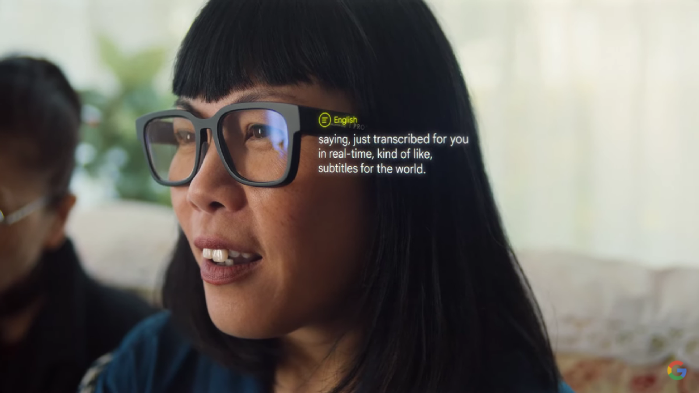

# Translation Glass Conceptual Model

## Goal of the Concept

The goal of this conceptual model is to define the foundational problem and system-level requirements for a smart, real-time language translation glasses system. This device is intended to assist multilingual users in understanding and interacting with foreign languages seamlessly in diverse real-world settings, such as international conferences, travel, education, and business.

## Approach to the Concept Creation

The concept was structured using the SysML v2 modeling language to maintain abstraction while ensuring system compositionality and traceability of user needs. The model includes a high-level problem definition, user-centered functional requirements, and core system constraints without locking the solution to a specific implementation or technology.

## List of the Main Components

- **MultilingualUser**  
  Represents the target user type who faces language comprehension challenges in international or multilingual contexts.

- **ComprehensionBarrier**  
  Represents the symptom or struggle faced by users when they cannot understand or participate due to language mismatches.

- **Functional Requirements**  
  - *RealTimeUnderstandingNeed*: Need for live translation support.  
  - *NaturalInteractionNeed*: Need for seamless interaction in conversations.  
  - *ContextAdaptiveTranslationNeed*: Need for translation aware of technical or cultural context.  
  - *DiscreetAssistiveTechnologyNeed*: Need for unobtrusive, professional technology use.  
  - *AutonomousNavigationNeed*: Need for independent travel and signage interpretation.

- **System Requirements**  
  - *PowerControl*: The system must provide a clear on/off switch.  
  - *LanguageSetupMenu*: The user must be able to configure language preferences.  
  - *TransparentDisplay*: Text should be overlaid without blocking the user's vision.

## Draft Plan for Implementation

1. **Requirement Validation**  
   - User research and scenarios to refine needs.
   - Stakeholder alignment on functional priorities.

2. **System Architecture Design**  
   - Design hardware and software modularly.
   - Identify interfaces for translation engines and UI.

3. **Prototype Development**  
   - Build minimal viable hardware with transparent display and basic language input/output.
   - Implement power switch and UI logic for language selection.

4. **Integration and Testing**  
   - Connect speech recognition, translation APIs, and subtitle rendering.
   - Conduct usability tests in various environments (e.g., noisy, fast-paced).

5. **Iterative Refinement**  
   - Improve latency, accuracy, and visual clarity.
   - Expand to support multiple languages and scenarios.

## Visual Representation

