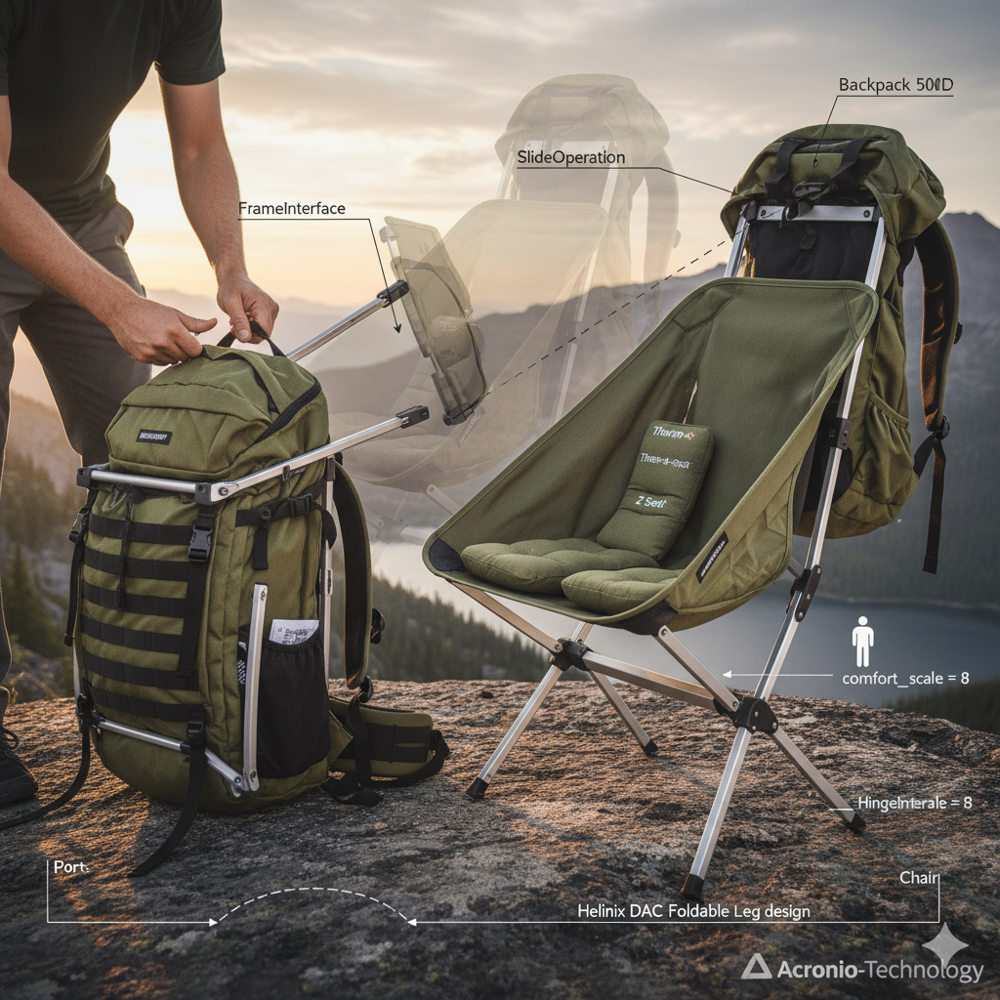

# Backpack-to-Chair Transformation Model

## **Goal of the Concept**

The goal of this concept is to model a **transformable backpack system** that can **reconfigure into a portable chair** through **human-driven mechanical interaction**.
The model aims to illustrate the **integration of structural, behavioral, and interactional elements** in a product that merges comfort, ergonomics, and functionality for outdoor or emergency applications.

---

## **Approach to the Concept Creation**

This SysML v2 model adopts a **system-of-systems approach**, decomposing the product into interacting subsystems:

* The **Backpack subsystem** represents the compact transport mode.
* The **Chair subsystem** represents the deployed seating mode.
* The **Human actor** enables transformation via defined interaction interfaces.

Using **port-based interfaces** (FrameInterface, HingeInterface, HumanInteraction, etc.), the model defines the **mechanical and human interaction links** that enable state transitions between configurations.
The **SlideAction** encapsulates the human-triggered behavior that reconfigures the structure, representing the transformation process from backpack to chair.

---

## **List of the Main Components**

| **Component**                                 | **Type**            | **Description**                                                                                     |
| --------------------------------------------- | ------------------- | --------------------------------------------------------------------------------------------------- |
| **SlideOperation**                            | *Item Definition*   | Represents the human reconfiguration process of sliding panels and extending legs.                  |
| **FrameInterface**                            | *Port Definition*   | Handles load transfer and provides feedback about structural support.                               |
| **HingeInterface**                            | *Port Definition*   | Transmits rotation commands and hinge lock status.                                                  |
| **HumanInteraction**                          | *Port Definition*   | Enables manipulation of panels and legs, including exertion feedback.                               |
| **Fabric, Frame, Hinge, Cushion, Leg, Human** | *Part Definitions*  | Structural and functional parts forming the backpack and chair assemblies.                          |
| **Backpack**                                  | *Part Definition*   | Structural composition of the transport configuration, including fabric, frame, hinges, and legs.   |
| **Chair**                                     | *Part Definition*   | Deployed configuration with cushions, legs, and a supporting frame.                                 |
| **SlideAction**                               | *Action Definition* | Represents the behavioral transformation process connecting human input and system reconfiguration. |
| **backpackChairContext**                      | *System Context*    | Assembles Backpack, Chair, and Human parts, defining transformation and interconnections.           |

---

## **Draft Plan for Implementation**

1. **Conceptual Modeling Phase**

   * Define system boundaries (Backpack, Chair, Human).
   * Identify transformation behavior (SlideAction and SlideOperation).

2. **Structural Modeling**

   * Develop internal part hierarchies and port connections.
   * Establish interfaces linking mechanical and fabric components.

3. **Behavioral Modeling**

   * Integrate transformation behavior between system states.
   * Model the action flow of the SlideOperation.

4. **Validation & Visualization**

   * Use SysML v2 views (`asAssemblyDiagram`) to visualize subsystem interconnections.
   * Simulate human interaction triggering system reconfiguration.

5. **Implementation Phase**

   * Integrate CAD and mechanical simulation data.
   * Validate load transfer and ergonomic constraints.
   * Iterate model refinement using Acronio-Technology for compositional integration.

---

## **Visual Representation**

---

