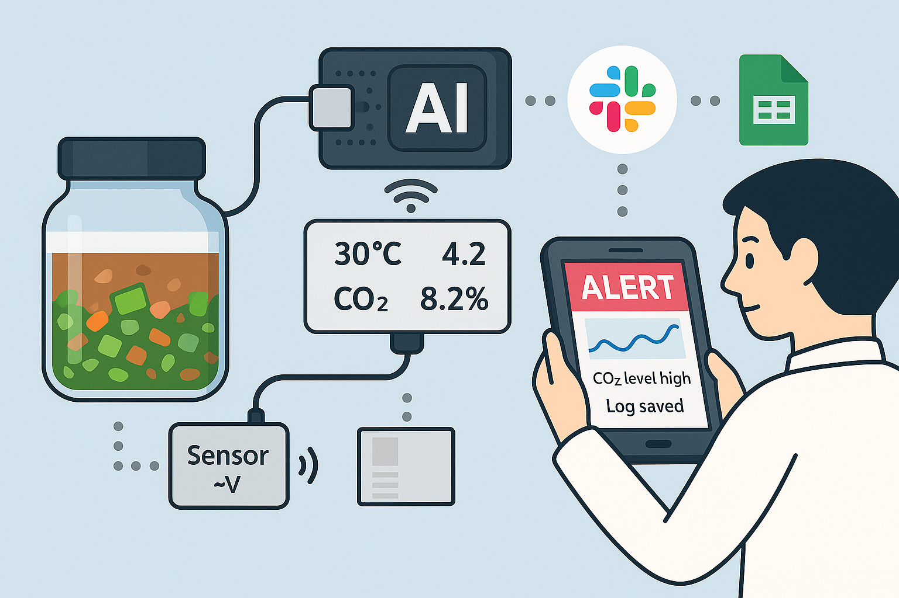

# 🍶  model.md — Fermentation Monitoring System
_Last updated: 2025-11-04 (JST)_  
_Ken Katakura_  
_82433166_

## 🎯 Goal of the Concept

Sansho-zuke is a traditional fermented condiment from Hokkaido, Japan, made by mixing equal parts of **green chili peppers, rice malt (koji), and soy sauce**, and fermenting it naturally at room temperature for **six months to over a year**.  
Because it is a natural fermentation process, its flavor and aroma vary greatly depending on the season and environmental conditions.

The purpose of this model is to visualize and manage the fermentation process of **Sansho-zuke**, which I personally produce as an artisan and entrepreneur.  
The goal is to **control the uncertainty of natural fermentation through scientific data** and to achieve stable and reproducible product quality.

As the founder of **Kuramitsu**, a startup producing Sansho-zuke, I manage the fermentation process on-site every day.  
Through this hands-on experience, I realized that the inability to quantify the progress, flavor, and aroma of fermentation is the greatest bottleneck.  

This model integrates the intuition of a craftsman with the logic of a researcher,  
and is designed to achieve **“Visualization of Craftsmanship” — a Digital Twin of the artisan’s skill.**

---

## 🧩 Approach to the Concept Creation

This model was developed step by step, from problem structuring to Proof of Concept (PoC),  
following the **Systems Engineering process defined in ISO/IEC/IEEE 15288**.

---

### **Step 1: Problem Structuring**
#### 🎯 Goal: Identify the real challenges faced in the fermentation process.

As both an artisan and a practitioner, I have identified the following problems through firsthand experience:

- The internal state of the fermentation bottle (pH, temperature, gas generation) cannot be observed.  
- Quality depends on each craftsman’s subjective judgment, leading to inconsistency.  
- External appearance and aroma cannot reveal the true internal fermentation state.  
- Records are handwritten, making data comparison and traceability difficult.  

Based on these findings, the process was structured in SysML v2, following  
**Business Mission Analysis (BMA) → Stakeholder Requirements (StRS) → System Requirements (SyRS)**.

| Level | Objective | Description |
|-------|------------|-------------|
| **BMA** | Stabilize fermentation quality | Transform artisans’ tacit knowledge into data to enhance reproducibility. |
| **StRS** | Stakeholder needs | Organize expectations from craftsmen, managers, executives, and customers. |
| **SyRS** | System requirements | Define measurable functions: sensing, recording, analysis, alerting, and visualization. |

---

### **Step 2: Concept Modeling**
#### 🎯 Goal: Define the abstract structure of the fermentation monitoring system using SysML v2.

This system is based on the concept of **“AI-assisted craftsmanship”**,  
and was modeled in SysML v2 using the following six packages:

| Package | Role |
|----------|------|
| **Domain** | Defines measurement items such as temperature, pH, CO₂, and time. |
| **Data** | Defines structured data such as sensor output and inferred fermentation state. |
| **Ports** | Defines input/output ports for measurement, communication, display, and notification. |
| **Parts** | Defines physical components: bottle, sensor, AI, and applications. |
| **Behavior** | Defines the monitoring workflow and logical data flow. |
| **Context** | Defines the overall system configuration and interconnections. |

The data flow follows this logic:  
Sensors collect fermentation data → AI infers progress and anomalies →  
results are linked to Slack notifications, Google Sheets records, and a tablet dashboard display.

---

### **Step 3: Proof of Concept (PoC) Modeling**
#### 🎯 Goal: Realize the conceptual model in an operational, real-world setup.

The conceptual model was concretized into a working system configuration implemented in my own production site.  
The actual components used are as follows:

| Component | Product Name | Role |
|------------|---------------|------|
| **FermentationBottle** | HARIO FKT-1000 Stainless Steel Bottle | Fermentation container with sensor port. |
| **SensorUnit** | Atlas Scientific EZO™ pH + DS18B20 + SCD41 CO₂ Sensor | Measures fermentation parameters. |
| **AIRepository** | Raspberry Pi 5 (8GB) | Performs local AI analysis and inference. |
| **RecordExportApp** | Google Sheets API Connector | Automatically logs fermentation data. |
| **SlackNotifierApp** | Slack Incoming Webhook Service | Sends alerts and progress updates. |
| **DisplayInterface** | Samsung Galaxy Tab Active4 Pro | Visual dashboard for monitoring. |
| **Maker / Manager** | Myself (artisan) and production manager | Operate and supervise system performance. |

Through this PoC, the goal was to demonstrate the concept of  
**“Craftsmanship Proven by Data.”**

---

## 🖼️ System Visualization

The figure below shows the overall PoC configuration.

**Data flow:**  
Fermentation Bottle (left) → Sensor → Raspberry Pi (AI) →  
Slack / Google Sheets → Tablet Display → Artisan (right)

---

## ⚙️ List of the Main Components

| Component | Role and Design Intention |
|------------|---------------------------|
| **FermentationBottle** | The physical vessel that holds the Sansho-zuke ingredients and enables natural fermentation. Equipped with a sensor port, it serves as the **boundary between the physical world and the digital monitoring system**. |
| **SensorUnit** | Measures temperature, pH, and CO₂ concentration, and transmits data to the AIRepository via Wi-Fi. Composed of Atlas Scientific modules, it acts as the **“observer” that converts analog fermentation phenomena into digital signals.** |
| **AIRepository** | Runs on a Raspberry Pi and analyzes incoming sensor data to estimate fermentation progress (FermentationState) and detect anomalies (Alert). Functions as the **digital counterpart of the artisan’s judgment — the core of the system.** |
| **RecordExportApp** | Automatically records AIRepository output to Google Sheets, building a historical dataset for comparison and traceability. Serves as the **shared fermentation data infrastructure for team collaboration.** |
| **SlackNotifierApp** | Sends real-time notifications of fermentation anomalies or completion to Slack. Provides **instant alerts and peace of mind through human-centered feedback loops.** |
| **DisplayInterface** | A Samsung tablet displaying an integrated dashboard combining Slack and Sheets data. Acts as the **visual interface for observation, understanding, and decision-making.** |
| **Maker / Manager** | Observes fermentation progress and makes adjustments as needed. Artisans handle daily operations; managers focus on quality assurance. Together, they form a **human–AI collaborative quality maintenance cycle.** |

---

## 🚀 Draft Plan for Implementation

### Step 1: Sensor Integration
- Install pH, temperature, and CO₂ sensors in the HARIO stainless bottle.  
- Connect to Raspberry Pi for data acquisition.

### Step 2: Data Processing and AI Inference
- Use Python scripts for data collection and AI-based estimation.  
- Implement integration with Slack notifications and Google Sheets logging.

### Step 3: Proof of Concept Execution
- Conduct tests using actual fermentation batches.  
- Calibrate algorithms for progress estimation and anomaly detection.

### Step 4: Evaluation and Refinement
- Compare AI estimations with artisan judgment to validate consistency and reliability.

### Step 5: Scaling and Standardization
- Design a standardized protocol for deployment across multiple artisans and factories.

---

## 📈 Expected Outcomes

- Establish a system that **digitally validates artisan intuition.**  
- Reduce variability in fermentation quality and enhance reproducibility.  
- Facilitate training, quality assurance, and brand trust.  
- Pioneer a new cultural synthesis of **Natural Fermentation × AI × Craftsmanship.**

---

## 🧭 Summary

As an artisan, researcher, and entrepreneur,  
I aim to preserve and evolve Japan’s traditional fermentation culture through digital transformation.  
This SysML v2 model redefines fermentation as a **Cyber-Physical System (CPS)**,  
balancing the **beauty of natural variability** with **scientific reproducibility**.

**Kuramitsu** connects the **hand of the craftsman** with the **intelligence of AI**,  
bringing **“Japanese fermentation to tables around the world.”**
