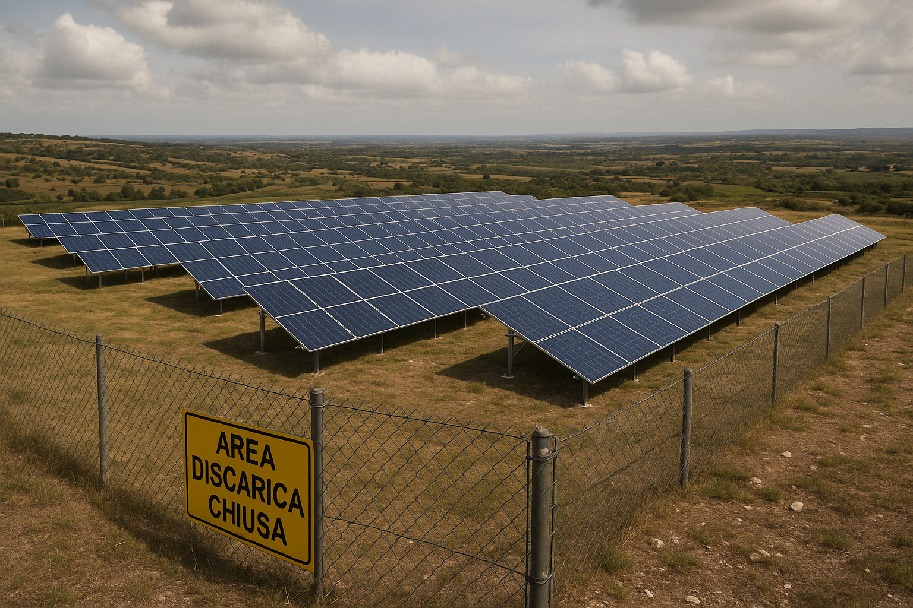

## Landfill Solar Concept Model

### (1) Goal of the Concept
The goal of this conceptual model is to evaluate and validate the feasibility of installing a solar photovoltaic system on a capped landfill. The purpose is giving a new economic value and life to this idle area. The system aims to deliver renewable energy while complying with environmental, technical, economic, and social constraints. The model is designed to support site planning, stakeholder involvement, incentive access, and proof-of-concept verification to enable informed investment and implementation decisions.

### (2) Approach to the Concept Creation
The model was developed using SysML v2 to create a modular, traceable, and stakeholder-aware system architecture. It includes multiple packages:
- **StructuralModel** to describe the physical elements (solar array, inverter, monitor, dashboard)
- **BehavioralModel** to capture the lifecycle (evaluation, installation, monitoring)
- **Requirements** to formalize constraints from stakeholders (e.g., cost limits, design regulations)
- **VerificationModel** to ensure all requirements are checked systematically
- **ProofOfConcept** to simulate and validate the chosen layout configuration (layoutB), including input from regulators and engineers.

Each component and constraint is explicitly linked using `connect` statements, enabling full traceability from selected configuration to stakeholder sign-off.

### (3) List of the Main Components
- **SolarPVArray** – Generates solar power; non-invasive ballasted mounting used.
- **Inverter** – Converts DC to AC and transmits performance data.
- **MonitoringSystem** – Processes inverter data and triggers alerts.
- **Dashboard** – Displays output and monitoring results.
- **LayoutOption** – Configuration instances (layoutA, layoutB, layoutC) with specific cost, ROI, and access values.
- **Stakeholders** – Defined roles: Site Manager (Alessandro), Community Rep (Chiara), Engineer (Fabio), Regulator (ARPA), Advisor (Laura).
- **Requirements** – Cost cap, ROI limit, non-invasive constraints, public access, compatibility, incentive criteria.
- **Verification** – Automated checks for each requirement using selected layout.
- **ProofOfConcept** – A formalized validation involving simulation, verification checks, and stakeholder review.

### (4) Draft Plan for Implementation
1. **Run Site Evaluation** – Alessandro performs layout evaluations for three layout options.
2. **Select Configuration** – Alessandro chooses layoutB based on technical and financial fit.
3. **Verify Requirements** – Systematically test layoutB against budget, ROI, compatibility, and regulatory needs.
4. **Validate Proof of Concept** – Simulate feasibility with all reviewers (ARPA, Fabio, Chiara, Laura).
5. **Prepare for Installation** – Once validated, the system progresses to installation and monitoring.

---

### Visual Model Representation

