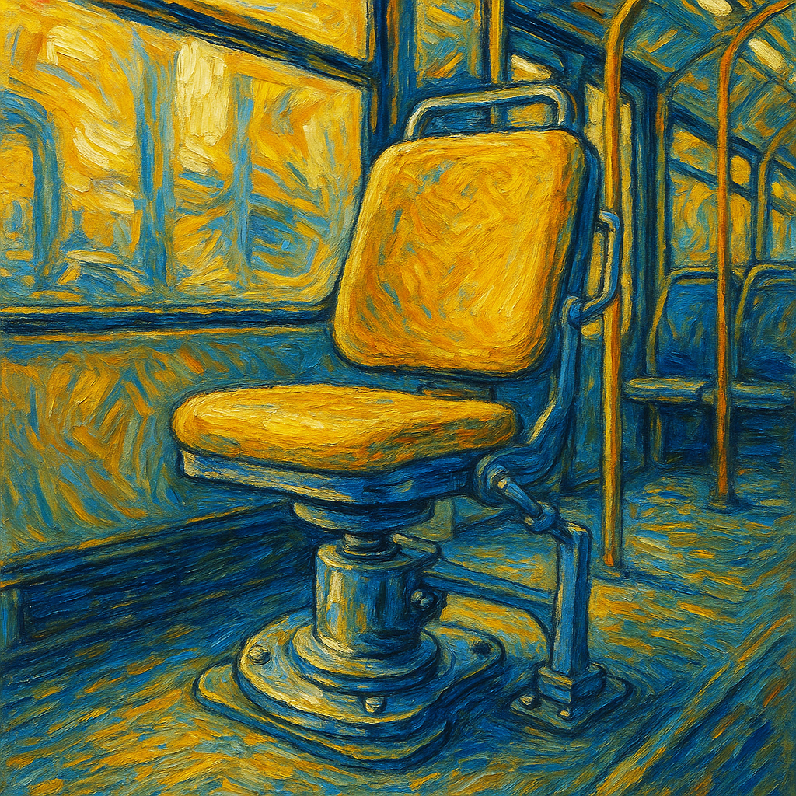
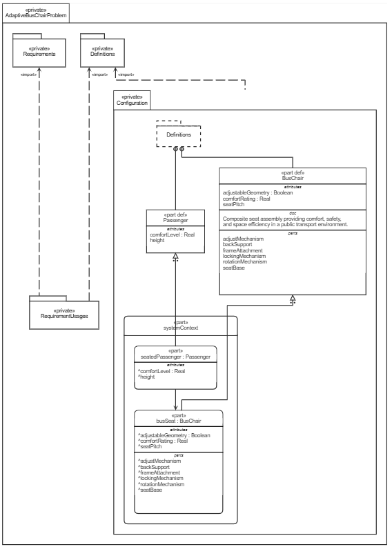
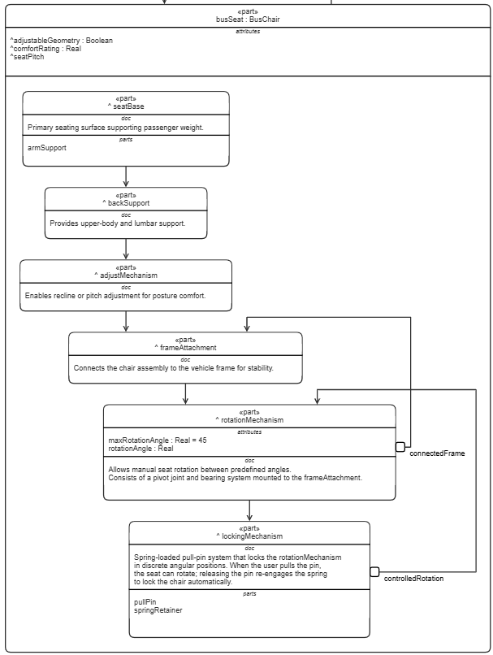

# Adaptive Bus Chair — Concept Model

## Goal of the Concept

The **Adaptive Bus Chair** concept aims to design a modular and adjustable passenger seat suitable for public transport vehicles (buses, vans, or shuttles).  
The concept focuses on improving **comfort, accessibility, and modularity**, while ensuring compliance with **vehicle safety standards (ECE R14/R17)**.  
This proof-of-concept (PoC) serves to evaluate **technical feasibility and minimal viability** using real, market-available mechanical components.

---

## Approach to the Concept Creation

The conceptual model is developed in SysML to **capture structure, interfaces, and traceability** between passenger needs, system design, and verification requirements.  
The modeling approach follows these principles:

1. **Abstraction and modularity** — The model separates high-level definitions (e.g., *BusChair*, *Passenger*) from implementation details.
2. **Reusability** — Market components are encapsulated in a `VendorParts` package for later reuse or substitution.
3. **Traceability** — Structural links connect parts, enabling future requirement satisfaction or simulation-based verification.
4. **Incremental realization** — The PoC model evolves toward a vehicle-ready assembly without overdefining geometry or manufacturing data.

---

## List of the Main Components

### Conceptual Definitions
- **BusChair** — Defines the structure of an adjustable seat, including seat base, back support, locking, and rotation mechanisms.
- **Passenger** — Represents the human interaction element, including height and comfort level attributes.

### Vendor Parts (Market-Available Components)
- **KIPP K0367 Pull Pin** — A spring-loaded steel indexing plunger used to lock the seat rotation mechanism at defined positions.  
  *Supplier:* KIPP USA  
  *Material:* AISI 303 Stainless Steel  
  *Function:* Provides reliable mechanical locking under vibration.
  
- **Scopema Turntable Base (ECE R14/R17)** — A low-profile, vehicle-certified seat swivel base used for controlled rotation and orientation.  
  *Supplier:* Scopema / RIB  
  *Compliance:* ECE R14/R17, TÜV  
  *Function:* Enables seat rotation with detents at 0°, 90°, and 180°.
  
- **Unwin Slide Track Anchorage (ATF1200)** — An aluminum slide track system securing the seat to the vehicle floor.  
  *Supplier:* Unwin Safety Systems  
  *Function:* Provides structural anchoring with adjustable seat positioning.

### Prototype Assembly
- **BusChair_PoC** — The integrated prototype combining the Scopema base, KIPP lock, and Unwin anchorage to demonstrate a feasible adaptive bus seat.
- **ComfortFeedback Interface** — Connects passenger data (pressure, comfort) with seat response attributes for comfort evaluation.

---

## Draft Plan for Implementation

1. **Concept Validation (Digital)**
   - Use the SysML model to validate assembly relations, mechanical dependencies, and conceptual behavior.
   - Check logical consistency between parts and interfaces.
   
2. **Component Procurement**
   - Source market-ready components (Scopema, KIPP, Unwin) as defined in the `VendorParts` package.
   
3. **Prototype Assembly**
   - Build a low-fidelity physical prototype for fit and motion testing.
   - Integrate the rotation and locking mechanisms for operability.
   
4. **Testing and Verification**
   - Conduct static load and vibration tests to confirm compliance with ECE R14/R17.
   - Validate comfort metrics via passenger trials (using the ComfortFeedback interface concept).

5. **Iteration**
   - Update SysML model with measured performance data.
   - Refine for manufacturability and modular production readiness.

---

## Visual Representation

---

**File purpose:**  
This `model.md` document provides a human-readable overview of the conceptual model for review, communication, and integration into design documentation workflows.
