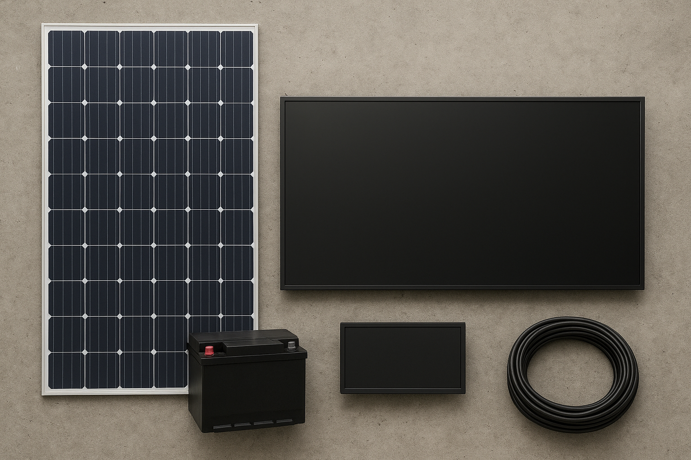

# Green Resilience Station (GRS) – Concept Model

**File:** `GRS.sysml`
**Language:** SysML v2
**Author:** Wenbo Shi
**Date:** November 2025

---

## Table of Contents
- [1. Overview](#1-overview)
- [2. System Concept](#2-system-concept)
- [3. Requirements Definition](#3-requirements-definition)
- [4. Structural Definition](#4-structural-definition)
  - [4.1 Components](#41-components)
  - [4.2 Connections](#42-connections)
- [5. Behavioral Logic](#5-behavioral-logic)
  - [5.1 States](#51-states)
  - [5.2 Event Flow](#52-event-flow)
- [6. Verification Logic](#6-verification-logic)
- [7. Logical Summary](#7-logical-summary)

---

## 1. Overview

The **Green Resilience Station (GRS)** is a **self-sustaining energy and communication hub** designed to maintain essential services during both **normal** and **emergency** conditions.
It combines **renewable energy generation**, **battery storage**, and **communication continuity** to support public resilience in disaster-prone urban areas.

---

## 2. System Concept

The GRS is designed to achieve the following **core capabilities**:

1. **Energy Autonomy** – Operate independently from the power grid under normal conditions using solar generation.
2. **Emergency Power Availability** – Supply backup power for at least 6 hours during grid failure.
3. **Communication Continuity** – Maintain Wi-Fi and alert broadcasting during disasters.

Together, these ensure **energy resilience**, **operational continuity**, and **public accessibility**.

---

## 3. Requirements Definition

The **Requirements Package** defines the three principal performance objectives of GRS:

| **ID** | **Requirement Name**       | **Description**                                                           | **Formal Constraint**               |
| ------ | -------------------------- | ------------------------------------------------------------------------- | ----------------------------------- |
| 1      | EnergyAutonomyRequirement  | GRS shall achieve full energy autonomy under normal solar conditions.     | `energyGenerated >= energyConsumed` |
| 2      | EmergencyPowerAvailability | GRS shall provide at least 6 hours of emergency power after grid failure. | `backupDuration >= 6 [h]`           |
| 3      | CommunicationContinuity    | GRS shall maintain Wi-Fi and alert broadcasting during disaster mode.     | `commLink == true`                  |

These requirements provide the **functional and quantitative benchmarks** for system validation.

---

## 4. Structural Definition

The **Structure Package** models the **physical and logical components** of the GRS.

### 4.1 Components

| **Component**              | **Description**                                             | **Key Attributes**                          |
| -------------------------- | ----------------------------------------------------------- | ------------------------------------------- |
| **SolarPanel**             | Generates electrical energy from sunlight.                  | `outputPower : power`                       |
| **Battery**                | Stores energy for backup and regulates power supply.        | `capacity : energy`, `stateOfCharge : Real` |
| **DisplayUnit**            | Provides public interface for environmental data or alerts. | `powerDemand : power`                       |
| **CommunicationModule**    | Maintains network connectivity (Wi-Fi, alerts).             | `commStatus : Boolean`                      |
| **PowerController**        | Regulates energy flow between components.                   | Ports: `solarIn`, `batteryIO`, `displayOut` |
| **GreenResilienceStation** | System composition integrating all subsystems.              | Aggregates all components and interfaces.   |

### 4.2 Connections

Energy and data flows are modeled through **ports and interfaces**:

* `solar.outputPower → controller.solarIn.powerFlow`
* `controller.displayOut.powerFlow → display.powerDemand`
* `controller.batteryIO.powerFlow ↔ battery.capacity`

These define how energy is distributed between the solar generation, storage, and consumption subsystems.

---

## 5. Behavioral Logic

The **Behavior Package** models system operation as a **state machine** with two major modes:

### 5.1 States

| **State**           | **Description**                                                  | **Actions**                                    | **Transition Trigger**                   |
| ------------------- | ---------------------------------------------------------------- | ---------------------------------------------- | ---------------------------------------- |
| **NormalOperation** | Normal solar operation with active display and energy storage.   | `activateAdvertising`, `generateAndStorePower` | On `Grid Failure` → **EmergencyMode**    |
| **EmergencyMode**   | Activated during grid failure, prioritizing essential functions. | `provideBackupPower`, `enableCommunication`    | On `Grid Restored` → **NormalOperation** |

### 5.2 Event Flow

1. **NormalOperation**

   * GRS uses solar energy to power the display and charge the battery.
   * Advertising or environmental data is shown on the display.
2. **Grid Failure Detected**

   * System transitions to **EmergencyMode**.
3. **EmergencyMode**

   * Solar or battery power supplies critical systems.
   * Communication module remains active to provide alerts/Wi-Fi.
4. **Grid Restored**

   * GRS returns to **NormalOperation**, resuming full operations.

This behavioral structure ensures **autonomous transitions** and **resilient service continuity**.

---

## 6. Verification Logic

The **Verification Package** defines test cases ensuring each requirement is met by the system model.

| **Test Case**             | **Purpose**                                                      | **Assertion**                                            |
| ------------------------- | ---------------------------------------------------------------- | -------------------------------------------------------- |
| **EnergyFeasibilityTest** | Validates that generated solar power meets demand.               | `(solar.outputPower * 6h) >= (display.powerDemand * 6h)` |
| **BackupDurationTest**    | Ensures battery capacity can sustain display load for ≥ 6 hours. | `(battery.capacity / display.powerDemand) >= 6h`         |

Both tests use quantitative constraints to confirm **energy sufficiency** and **backup reliability** under modeled conditions.

---

## 7. Logical Summary

The **Green Resilience Station (GRS)** model integrates:

* **Requirements-based system design** (for traceable compliance),
* **Energy and communication subsystem modeling** (for resilience assurance),
* **State-driven operational logic** (for autonomous mode transitions), and
* **Formal verification cases** (for design validation).

This SysML v2 PoC provides a **model-based foundation** for implementing and simulating the GRS concept, bridging **sustainable energy design** and **emergency preparedness** through a **structured systems engineering framework**.

