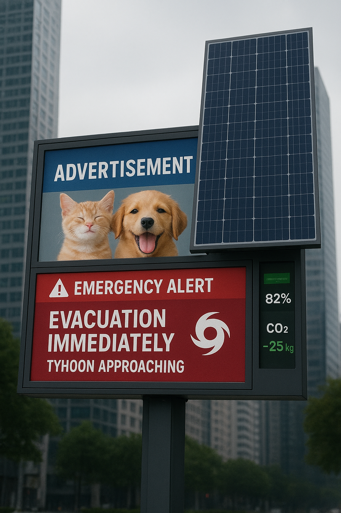

# Green Resilience Station (GRS) – Proof of Concept (PoC) Model

**File:** `GRS_POC.sysml`  
**Author:** Wenbo Shi  
**Language:** SysML v2  
**Date:** November 2025  

---

## Table of Contents
- [1. Introduction](#1-introduction)  
- [2. Proof of Concept Development Process](#2-proof-of-concept-development-process)  
  - [2.1 Purpose](#21-purpose)  
  - [2.2 Model Construction Steps](#22-model-construction-steps)  
- [3. Comparison with Concept Model](#3-comparison-with-concept-model)  
  - [3.1 Structural Refinements](#31-structural-refinements)  
  - [3.2 Behavioral Enhancements](#32-behavioral-enhancements)  
  - [3.3 Verification Extensions](#33-verification-extensions)  
- [4. Discussion of System Maturity](#4-discussion-of-system-maturity)  
- [5. Conclusion](#5-conclusion)  
- [Appendix A: Element Mapping Table](#appendix-a-element-mapping-table)  

---

## 1. Introduction

The **Green Resilience Station (GRS)** is a system designed to ensure **energy autonomy** and **communication continuity** in urban environments during both normal and emergency conditions.  
The initial **Concept Model (`GRS.sysml`)** defined a high-level architecture emphasizing *requirements traceability*, *functional behavior*, and *energy resilience principles*.  

The **Proof of Concept Model (`GRS_POC.sysml`)** advances this design by introducing **specific component definitions**, **quantitative constraints**, and **testable verification logic**.  
This report documents the PoC modeling process, compares it with the conceptual model, and formalizes the element mappings between both representations.

---

## 2. Proof of Concept Development Process

### 2.1 Purpose

The goal of the PoC was to **validate the conceptual feasibility** of the GRS through a system-level simulation-ready model.  
Specifically, the PoC sought to:

* Translate conceptual elements into **concrete, off-the-shelf components**;  
* Implement **formal parameterization** of energy and communication flows;  
* Define **state-based behavioral logic** supporting autonomous transitions; and  
* Introduce **quantitative verification tests** for system validation.

### 2.2 Model Construction Steps

The PoC development followed four primary stages:

1. **Requirement Formalization**  
   - Retained the three conceptual requirements: energy autonomy, emergency availability, and communication continuity.  
   - Converted textual statements into formal SysML constraints using `ISQ::energy`, `ISQ::time`, and Boolean attributes.

2. **Structural Definition**  
   - Each conceptual subsystem (solar, battery, display, communication) was realized as a **SysML `part def`** with quantifiable attributes.  
   - **Energy and data interfaces** were explicitly defined via `PowerPort` and `DataPort`, enabling traceable inter-component flow modeling.

3. **Behavioral Realization**  
   - Implemented a **state machine** with explicit transitions between `NormalOperation` and `EmergencyMode`.  
   - Introduced **trigger attributes** (`Grid Failure`, `Grid Restored`) and **actions** for system functions.

4. **Verification Logic**  
   - Defined **model-level verification cases** (`EnergyFeasibilityTest`, `BackupDurationTest`) directly referencing quantitative parameters.  
   - Established executable constraints to test system performance against requirement thresholds.

---

## 3. Comparison with Concept Model

### 3.1 Structural Refinements

| Aspect | Concept Model | PoC Model |
| ------- | -------------- | ---------- |
| **Component Abstraction** | Logical components without product specificity. | Each subsystem mapped to an actual product (e.g., *LVYUAN 410W Solar Panel*, *Anker Solix C1000*). |
| **Interface Modeling** | Descriptive flow references only. | Defined formal `PowerPort` and `DataPort` interfaces for energy and data transmission. |
| **System Composition** | Abstract aggregation (`GreenResilienceStation` as a container). | Concrete part composition with explicit flow definitions (`SolarToBattery`, `BatteryToDisplay`, etc.). |
| **Quantitative Attributes** | Qualitative descriptions (e.g., “provides power”). | Introduced measurable attributes (`capacity`, `outputPower`, `powerDemand`). |

---

### 3.2 Behavioral Enhancements

| Aspect | Concept Model | PoC Model |
| ------- | -------------- | ---------- |
| **State Definition** | Textual description of two operating modes. | Explicit `state def` hierarchy within a behavioral package. |
| **Transition Triggers** | Implicit (e.g., “on grid failure”). | Modeled as formal `attribute def` triggers (`Grid Failure`, `Grid Restored`). |
| **Actions** | Mentioned as narrative behaviors. | Implemented as executable `action def` elements (`provideBackupPower`, `generateAndStorePower`). |
| **Autonomy Logic** | Descriptive transitions. | Executable transitions with `entry` and `do` actions for autonomous state behavior. |

---

### 3.3 Verification Extensions

| Aspect | Concept Model | PoC Model |
| ------- | -------------- | ---------- |
| **Verification Presence** | Conceptual assertions only. | Full `verification def` with test cases referencing system parameters. |
| **Energy Balance** | Described as design intent. | Expressed quantitatively as `(solar.outputPower * 6h) ≥ (display.powerDemand * 6h)`. |
| **Backup Capacity** | Qualitative (“supply backup for 6h”). | Defined as `(battery.capacity / display.powerDemand) ≥ 6 [h]`. |
| **Traceability** | Implicit alignment to requirements. | Explicit traceability through imported `Requirements` and `Structure` packages. |

---

## 4. Discussion of System Maturity

The **GRS_POC** model represents a transition from a **Concept Model (CM-level)** to an **Implementation-Level Model (IM-level)**.  
Key advances include:

1. **Model Executability** – Quantitative attributes and constraints enable partial simulation or automated checking.  
2. **Design Feasibility** – Integration of real-world product parameters demonstrates technological viability.  
3. **System Traceability** – Requirements, structure, behavior, and verification elements are explicitly connected.  
4. **Behavioral Autonomy** – The state machine allows self-regulated transitions without external input.  

Collectively, these improvements reflect a **higher system maturity level**, suitable for future physical prototyping or digital twin development.

---

## 5. Conclusion

The **Proof of Concept model** successfully transforms the original **Green Resilience Station** concept into a **model-based, verifiable system**.  
By grounding abstract capabilities in quantitative and executable model elements, the PoC validates the **technical feasibility** of energy autonomy and communication continuity in urban resilience infrastructure.

This advancement demonstrates the value of **Model-Based Systems Engineering (MBSE)** in bridging **conceptual design** and **prototype realization** through **structured SysML v2 modeling**.

---

## Appendix A: Element Mapping Table

| **Concept Model Element** | **PoC Model Element** | **Mapping Type** | **Description / Justification** |
| -------------------------- | --------------------- | ---------------- | ------------------------------- |
| `SolarPanel` | `SolarPanel` (LVYUAN 410W) | Realization | Conceptual solar unit realized as a specific product. |
| `Battery` | `Battery` (Anker Solix C1000) | Realization | Replaced abstract energy storage with quantifiable product parameters. |
| `DisplayUnit` | `DisplayUnit` (Samsung QMC Series) | Realization | Modeled with concrete power demand and ports. |
| `CommunicationModule` | `CommunicationModule` (ESP32-C3) | Realization | Introduced formal data port and Boolean commStatus. |
| `GreenResilienceStation` | `GreenResilienceStation` | Refinement | Now includes explicit flow connections and composed parts. |
| `Energy Flow (conceptual)` | `SolarToBattery`, `BatteryToDisplay` | Decomposition | Abstract flow replaced by named flow definitions. |
| `Operational Modes` | `NormalOperation`, `EmergencyMode` | Refinement | Conceptual states implemented as formal SysML states. |
| `Transition Logic` | `Grid Failure`, `Grid Restored` | Addition | Introduced explicit triggers for mode transitions. |
| `Behavioral Description` | `action def` set (e.g., `generateAndStorePower`) | Expansion | Narrative functions expressed as SysML actions. |
| `Verification Concept` | `EnergyFeasibilityTest`, `BackupDurationTest` | Addition | New verification elements provide quantitative validation. |
| *(no equivalent)* | `PowerPort`, `DataPort` | New Interface Layer | Enables energy/data flow traceability across subsystems. |

