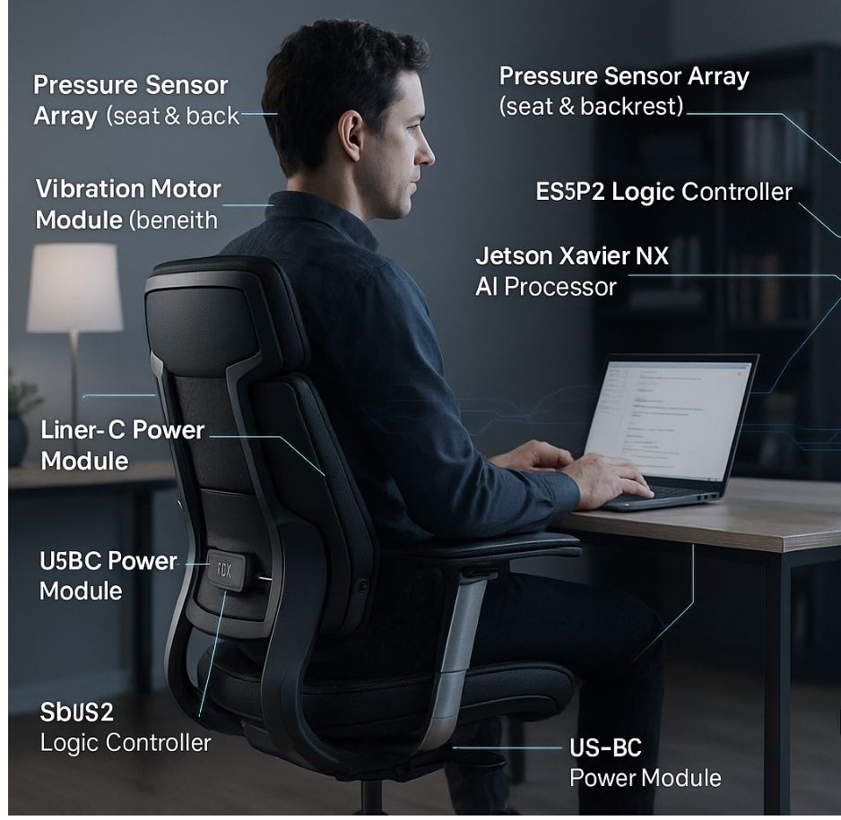

# MoveWell Smart Chair | Proof of Concept

## 🪑 Concept Overview
The **MoveWell Smart Chair** is an intelligent ergonomic seating system designed to monitor user posture, sitting duration, and movement patterns to promote healthy sitting behavior.  
The chair integrates sensors, actuators, and AI-based analytics to detect prolonged sitting, alert the user, and encourage periodic standing or posture adjustments.

This model represents the **proof-of-concept architecture** combining both **hardware and software elements**, aligned with a SysML v2-based systems engineering approach.

---

## 🎯 Goal of the Concept
The primary goals of the MoveWell Smart Chair are to:

- Promote **ergonomic well-being** and prevent sedentary fatigue by monitoring user posture.
- Provide **real-time feedback** using vibration alerts and display notifications.
- Support **data synchronization** with an external application for posture tracking.
- Demonstrate a **model-based co-design workflow** integrating hardware and software design in SysML v2.

---

## ⚙️ System Approach
The concept is based on a **Model-Based Systems Engineering (MBSE)** methodology using **SysML v2** to describe:

- System structure and hierarchy of components.
- Behavioral states and event-driven transitions.
- Functional allocations between physical components and software actions.
- Ergonomic design parameters and proof-of-concept constraints.

### Modeling Features
- **Structural Definition:** Core physical components such as sensors, actuators, controller, and power module.  
- **Behavioral Definition:** Chair states including *Idle*, *Sitting*, *Alert*, *Vertical Lock*, and *Reset*.  
- **Functional Realization:** Logical functions like `Monitor Sitting Time`, `Alert User`, and `Enforce Standing Period` mapped to real components.  
- **Ergonomic Design:** Adjustable features, lumbar support, and materials for comfort and usability.

---

## 🧩 System Components

| Category | Component | Description |
|-----------|------------|-------------|
| **Sensor** | Pressure Sensor | Detects user presence and sitting pressure. |
| **Actuator** | Vibration Motor | Provides haptic feedback for posture alerts. |
| **Motion** | Linear Actuator | Controls seat tilt for standing prompts. |
| **Controller** | ESP32 Module | Processes data, manages states, and sends commands. |
| **AI Processor** | Jetson Xavier NX | Executes posture recognition and trend analysis. |
| **Display** | Samsung Flip 2 | Visualizes posture data and analytics dashboard. |
| **Power Supply** | Anker PowerCore | Provides USB-C power to all active modules. |

---

## 🔄 Behavioral Model Summary
### Chair States
- **Idle:** No user detected, system awaiting activation.  
- **Sitting:** User detected; posture monitoring and timer started.  
- **Alert:** Sitting duration exceeds threshold; vibration alert triggered.  
- **Vertical Lock:** Seat tilts to encourage standing after repeated alerts.  
- **Reset:** Chair returns to default position after user leaves.

### Transitions
- `Idle → Sitting`: When user presence detected.  
- `Sitting → Alert`: After 60 minutes of continuous sitting.  
- `Alert → VerticalLock`: After 5 seconds of inactivity following alert.  
- `VerticalLock → Reset`: After 5 minutes or user absence.  
- `Reset → Idle`: Upon new user detection.

---

## 🧠 Software & Connectivity
The embedded firmware uses the **ESP32** controller for local logic, while the **Jetson Xavier NX** performs advanced analytics including:
- Posture classification (using machine learning inference)
- Sitting duration computation
- Wireless data transfer to the connected mobile app
- Visualization on **Samsung Flip 2** via a local network or BLE connection

---

## 🧱 Proof-of-Concept Implementation
The physical prototype integrates off-the-shelf components:
- **Pressure Sensors:** Interlink FSR 402 or SparkFun SEN-09376  
- **Vibration Motor:** Precision Microdrives 307-100  
- **Linear Actuator:** Firgelli Automations FA-35-S-12-4  
- **Controller:** ESP32 DevKit V1  
- **Power Supply:** Anker PowerCore PD 26800  
- **Display:** Samsung Flip 2 (digital whiteboard with IoT dashboard integration)

---

## 💼 Usage Scenario
**User Flow Example:**
1. The user sits on the MoveWell chair.  
2. Pressure sensors detect presence and start a sitting timer.  
3. After 60 minutes, the vibration motor triggers a subtle alert.  
4. If the user remains seated, the actuator tilts the chair to encourage standing.  
5. Data syncs to the MoveWell app, where the user reviews posture history and health trends.  

---

## 📈 Future Improvements
- Integration with cloud analytics and user behavior tracking.  
- Adaptive vibration feedback using AI-based fatigue estimation.  
- Modular design for integration into existing ergonomic office chairs.  
- Voice or gesture interaction for reset and mode control.  

---

## 📦 SysML v2 Integration Note
This conceptual model aligns with the SysML v2 structure provided earlier and can be extended using Acronio-Technology for compositional modeling across:
- **System definition packages**
- **Behavioral and requirement views**
- **Verification and performance simulation**

---

> Please note:  
> This model is a **conceptual proof-of-concept** and does not yet reference company-internal libraries or prior session models.  
> Use Acronio-Technology to ensure compositional and semantic integrity within SysML v2-based model repositories.

