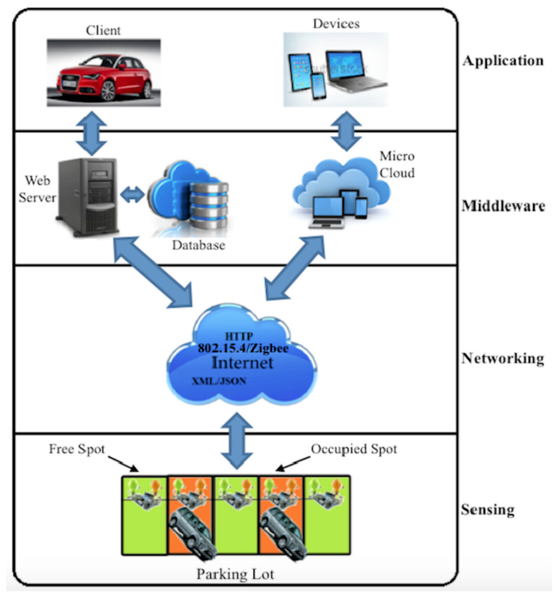

# **Proof of Concept (PoC): ADAS Urban Parallel Parking System**

---

## **Purpose of the Proof-of-Concept**

The **Proof-of-Concept (PoC)** demonstrates how the **ADAS Urban Parallel Parking System**, originally defined as a conceptual SysML v2 model, can be implemented and validated through a **digital twin simulation**.

It shows the system’s ability to:

* Detect a viable parallel parking space using simulated sensor data.
* Request and process driver confirmation before performing maneuvers.
* Autonomously steer, accelerate, and brake safely.
* React to obstacles and environmental changes dynamically.

This PoC bridges **model-based system design** and **software emulation**, providing early verification of the concept’s feasibility and offering stakeholders a tangible demonstration before physical prototyping.

---

## **Traceability Table: Conceptual Model to Proof-of-Concept Implementation**

| **Conceptual Model Element**               | **POC Model Element**                                                                             | **Transformation & Implementation Insight**                                                                      |
| ------------------------------------------ | ------------------------------------------------------------------------------------------------- | ---------------------------------------------------------------------------------------------------------------- |
| **Driver (Actor)**                         | `driverInterface` (Python GUI inputs: *Start Auto Park*, *Confirm Parking*, and feedback display) | Implemented as a GUI-driven actor providing control commands and receiving system feedback through dynamic text. |
| **Environment (Actor)**                    | `envSensors` module (sliders for `obstacleDistance`, `lightLevel`, and mock sensor conditions)    | Modeled as adjustable inputs representing dynamic urban environmental variables.                                 |
| **ADAS_ParkingSystem (System Part)**       | `ParkingStateMachine` class                                                                       | Implemented as a Python class with attributes and transitions mirroring SysML-defined system behavior.           |
| **State ‘Parking Behavior’**               | `step()` simulation loop logic                                                                    | Direct mapping of SysML state transitions into sequential conditional statements controlling real-time behavior. |
| **Attribute: `detectedSpaceWidth [m]`**    | GUI slider controlling width detection                                                            | Simplified physical sensor input into an adjustable parameter affecting state transitions.                       |
| **REQ_01_DetectParkingSpace**              | Width detection threshold (≥ 5.0 m)                                                               | Verified by triggering feedback and confirmation sequence in simulation.                                         |
| **REQ_02_ConfirmDriverApproval**           | GUI confirmation button                                                                           | Modeled as event-driven input validating user approval prior to maneuver start.                                  |
| **REQ_03_ExecuteSafeManeuver**             | Safety halt on `obstacleDistance < 0.5`                                                           | Implemented through logic pause/resume loop to simulate obstacle detection.                                      |
| **UrbanParkingContext**                    | Integrated GUI combining driver, environment, and system                                          | The top-level simulation interface emulating information flow between all actors.                                |
| **Flow Connections**                       | Variable bindings across GUI widgets and system model                                             | Represented as direct software linkages between Python variables and GUI controls.                               |
| **Feedback Mechanism (`feedbackDisplay`)** | On-screen status text                                                                             | Provides live status updates for user visibility and confirmation of system actions.                             |
| **Simulation Context (Digital Twin)**      | `digital_twin_dashboard.py`                                                                       | Executable environment for state evolution, feedback updates, and user interaction.                              |

---

## **Visual Traceability Diagram**

## **Implementation Summary**

* The conceptual SysML model defined **abstract system logic** (actors, attributes, flows, and states).
* The PoC implemented this logic as an **interactive digital twin**, linking **human commands**, **sensor inputs**, and **system behavior** in real time.
* Each element from the conceptual model has a **traceable, functional equivalent** in the simulation environment.
* The PoC verifies that conceptual behaviors are operationally viable, laying groundwork for full ADAS integration.

---

## **Conclusion**

The **ADAS Urban Parallel Parking Proof of Concept** validates that the conceptual SysML v2 model can be **operationalized** as a real-time simulation.
Through this transformation:

* Requirements are verified early.
* Stakeholders can interact with system logic visually.
* Engineering teams gain a **reference implementation** to build upon for higher-fidelity simulations or hardware integration.

This traceable linkage ensures that **every abstract design decision** in the conceptual model directly informs its **practical realization** in the proof-of-concept.

