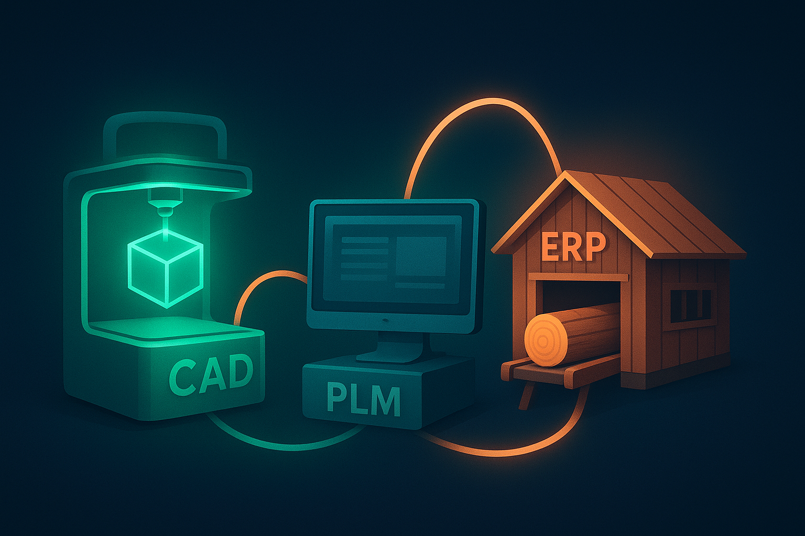

# 🧩 IT Tools Interconnection – Conceptual Model

## Goal of the Concept

The goal of this conceptual model is to **represent the digital thread connecting the core IT systems** used in the product lifecycle — from design to manufacturing.  
It visualizes how **CREO (CAD)**, **PLM Windchill**, and **SAP (ERP)** interact through the exchange of structured information such as **3D Models**, **Product BOMs**, and **Production Rates**.  

This model supports:
- Better understanding of **data flow and dependencies** across the engineering process.  
- Clear definition of the **interfaces** between systems.  
- Preparation for a future **proof-of-concept implementation** with real data exchange.

---

## Approach to the Concept Creation

The concept was developed iteratively using **SysML v2**, evolving through four stages:

1. **Model 1:** Defined the basic structure and a generic information flow.  
2. **Model 2:** Introduced specific data flows — *3D Model*, *Product BOM*, and *Production Rate*.  
3. **Model 3:** Added lifecycle management to the data items (design states such as *Conception*, *Review*, *Validated*).  
4. **Model 4:** Added detailed documentation (`doc`), metadata attributes, and clear system boundaries for readability and traceability.

The modeling approach follows SysML v2 best practices:
- **Items (`item def`)** represent the *data being exchanged*.  
- **Ports (`port def`)** represent the *interfaces where exchanges occur*.  
- **Parts (`part def`)** represent the *systems involved in the information flow*.

---

## List of the Main Components

### 🧩 **Items (Information Objects)**
- **`Model_3D`** – Represents the 3D design model created in **CREO**, transferred to **PLM** for validation and lifecycle control.  
  Includes metadata such as author, version, creation date, and last modification date.  

- **`ProductBOM`** – Represents the Product Structure generated in **PLM**, then transferred to **SAP** for manufacturing and production planning.  
  Tracks product ID, version, creation date, last modification date, and production rate.  

- **`ProductionRate`** – Represents manufacturing throughput data from **SAP**, used to synchronize production capabilities with product lifecycle data from **PLM**.  
  Includes unit, value, and timestamp attributes.

---

### 🧱 **System Parts**
- **`CAD_Creo`** – The **CAD system** responsible for generating 3D models and initial product structure data.  
- **`PLM_Windchill`** – The **Product Lifecycle Management** system serving as a central repository for validated design data and configuration control.  
- **`ERP_SAP`** – The **Enterprise Resource Planning** system that consumes BOM and production data for manufacturing planning and execution.  

---

### 🔗 **Ports and Interfaces**
- **`InfoPort`** – Defines the data interface between systems, managing in/out flows of `Model_3D` and `ProductBOM`.  
- **`creoToPlm`** – Interface connecting **CREO → PLM** (transfer of 3D Model and BOM).  
- **`plmToSap`** – Interface connecting **PLM → SAP** (transfer of BOM and production data).

---

## Draft Plan for Implementation

1. **Define Data Exchange Contracts:**  
   Use SysML v2 models to formalize data exchange specifications (attributes, formats, constraints).

2. **Map Logical to Physical Systems:**  
   Identify the real CREO, PLM, and SAP environments in use and map SysML ports to real APIs or integration endpoints.

3. **Implement Prototype Data Flow:**  
   - Export a sample 3D model from CREO.  
   - Store and manage its lifecycle in PLM Windchill.  
   - Synchronize its BOM with SAP.  

4. **Validate Lifecycle and Traceability:**  
   Ensure that lifecycle states are consistent between 3D model and BOM data (e.g., a BOM cannot be *Validated* if its 3D model is still *In Conception*).

5. **Deploy and Monitor:**  
   Establish feedback mechanisms to monitor data consistency and performance across systems.

---

## Visual Representation

Below is a visual placeholder representing the system interactions.

