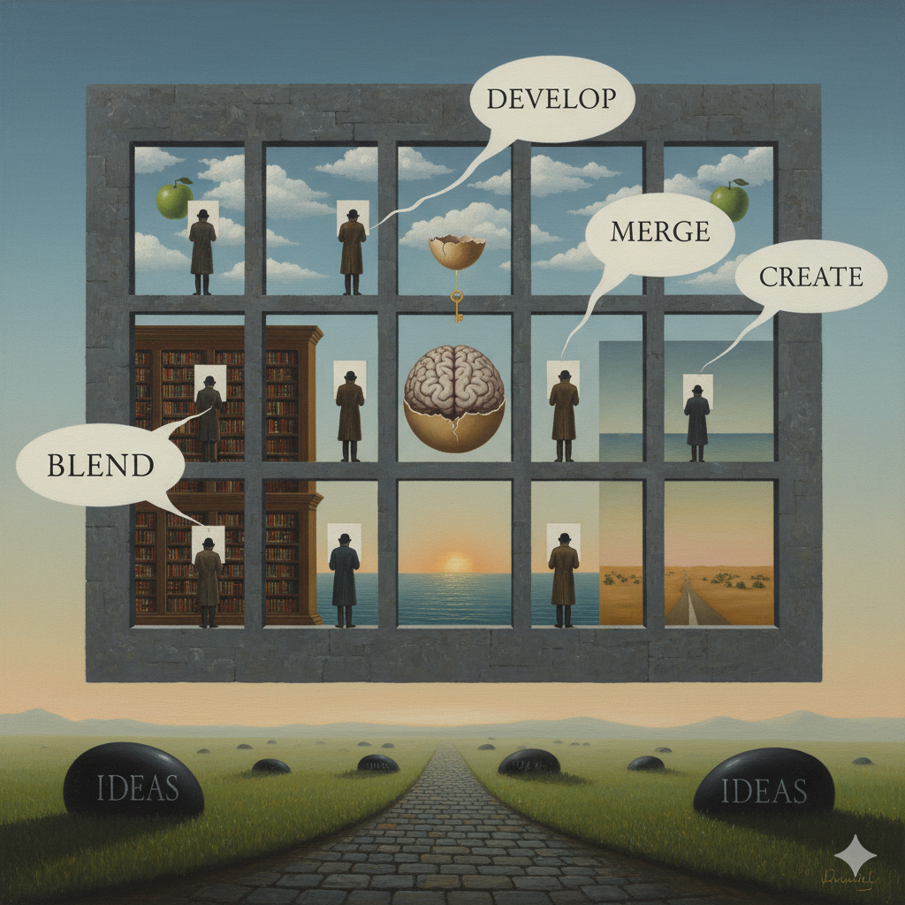

# IdeaWall Concept Model

## (1) Goal of the Concept
The IdeaWall is a collaborating system that allows users to exchange ideas with collaborators and work with them as a team. The wall includes a mechanism to input the ideas and to process them with operations such as development, merging, blending, and other ways to create new material out of the collaborative thoughts exchanged via the medium.

## (2) Approach to the Concept Creation
The conceptual model is structured using SysML v2 to promote modularity, abstraction, and flexible implementation. It separates core functionalities from physical technology by modeling generalized system components like input interfaces, displays, and a dynamic idea repository. The model treats ideas as structured objects enriched with origin metadata, rating vectors, and timestamps, enabling intelligent collaboration, evolution, and contextual reasoning across both co-located and remote users.

## (3) List of the Main Components
- **IdeaWall**: Integrates the display, input interface, and intelligent repository into a unified collaborative workspace.
- **Display**: A flexible visual output mechanism capable of presenting ideas and feedback, realized physically or virtually.
- **InputInterface**: Captures input via touch, pen, voice, and thought, designed to be technology-neutral.
- **IdeaRepository**: AI-powered system for storing, organizing, rating, and generating ideas based on context and user interactions.
- **User / RemoteUser**: Represent individual collaborators using the system either locally or from remote locations.
- **Idea**: Conceptual contributions tagged with origin, rating vector, and last-evaluated timestamp, enabling tracking and refinement.

## (4) Draft Plan for Implementation
1. **Build Proof-of-Concept**:
   - Select and model real-world devices (e.g., smartboards, tablets, microphones, EEG headbands).
   - Structure them into a `ProofOfConceptSystem` part definition.
2. **Develop Repository Intelligence**:
   - Integrate a language model to support idea storage, evolution, merging, and synthesis.
3. **Define Input/Output Interactions**:
   - Specify interface definitions between parts (e.g., EEG input to display response).
   - Enable blending of ideas from multiple users or modalities.
4. **Simulate Remote Collaboration**:
   - Prepare for asynchronous and real-time multi-user input.
   - Ensure seamless synchronization of idea content and contributions.
5. **Trace to Concept Model**:
   - Maintain traceability between proof-of-concept parts and their conceptual origins.
   - Use iterations to validate structure and refine system design.

