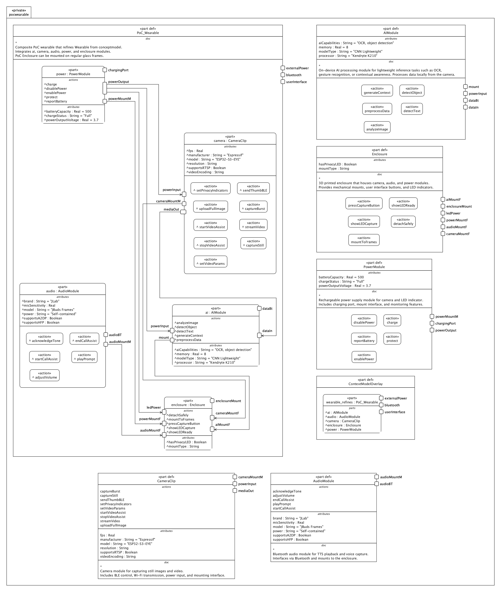
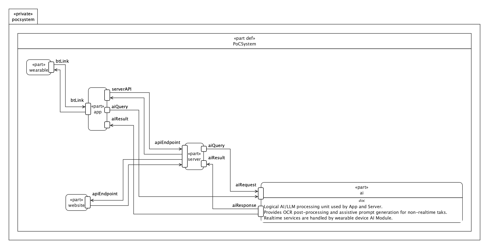

# Proof-of-Concept Documentation

## Purpose of the Proof-of-Concept

The goal of this proof-of-concept (PoC) is to validate the feasibility and integration strategy of the wearable assistive system outlined in the conceptual model. This PoC demonstrates real-time data capture, local AI inference, and communication with a mobile application, while ensuring modularity and realistic implementation using commercially available components. It serves as a preliminary but functional representation of the complete assistive wearable ecosystem, allowing iterative testing, validation, and refinement of hardware and software interactions.

| **Conceptual Model Element** | **POC Model Element**          | **Transformation & Implementation Insight**                                                                                            |
| ---------------------------- | ------------------------------ | -------------------------------------------------------------------------------------------------------------------------------------- |
| `Wearable`                   | `PoC_Wearable`                 | Refined as a composite subsystem integrating off-the-shelf audio glasses, ESP32 camera, and 3D-printed enclosure with local AI module. |
| `Camera`                     | `CameraClip`                   | Implemented using ESP32-S3-EYE. Supports BLE/Wi-Fi, real-time streaming and still capture. Custom mounting and power interfacing.      |
| `AudioModule`                | `JBuds Frames`                 | Commercial Bluetooth open-ear audio with embedded power and mic. Connected to app via BT. Mounted in enclosure.                        |
| `PowerModule`                | `Rechargeable Battery Pack`    | LiPo battery with 3.7V regulated output. Connects to all modules and supports external USB charging.                                   |
| `Enclosure`                  | `3D-Printed Mount`             | Custom enclosure designed to house camera, audio, AI, and power modules. Includes mounting and interface ports.                        |
| `AIModule`                   | `Kendryte K210`                | Lightweight AI processor for on-device OCR and object detection. Connected to camera and power. Communicates with app.                 |
| `App`                        | `Mobile App (Custom)`          | Cross-platform app with Bluetooth and Wi-Fi integration. Receives media, processes TTS, sends AI queries.                              |
| `Server`                     | `Cloud Server (AWS + Backend)` | Manages storage, authentication, and async AI queries. Interacts with app and web portal.                                              |
| `AIService`                  | `Remote LLM (Cloud-based)`     | Provides large-model reasoning for non-realtime queries. Complementary to on-device AI.                                                |
| `Website`                    | `Responsive Web Portal`        | Mirrors app functionality for families and volunteers. Connected via server APIs.                                                      |

## Wearable Proof-of-Concept
> 
> *Diagram depicts wearable hardware modules and data paths between them.*

## System Proof-of-Concept
> 
> *Diagram depicts user interfaces (wearable/app/website), backend services (server/AI), and data paths between them.*
