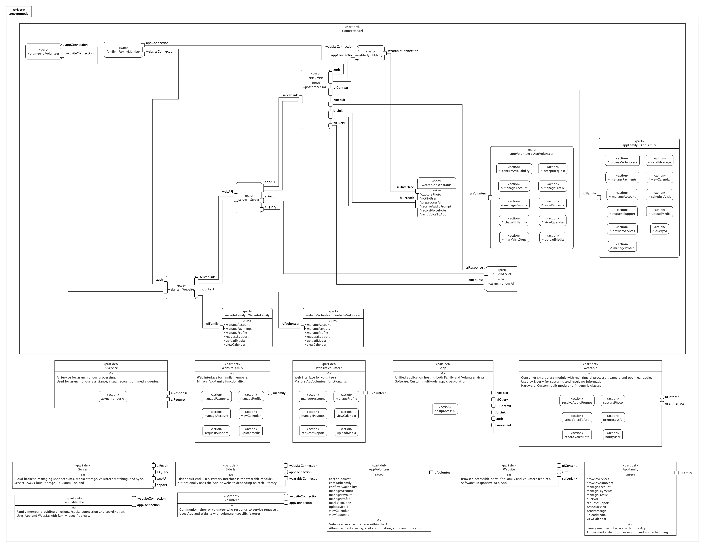

# PoC Smart Wearable System — Model Documentation

## Vision Statement
This system will evolve into an assistive technology ecosystem for older adults. It starts with a wearable prototype providing real-time, AI-supported audio-visual capture and feedback with personalized knowledge recall, then expands to family communication, and eventually volunteer services—forming a full care and coordination infrastructure. The roadmap enables early utility validation and a path to long-term social and commercial impact.

## Goal of the Concept
Develop a wearable assistive device tailored for older adults combining visual/audio I/O, on-device AI processing, and cross-platform mobile/web integration. The device supports safety, contextual awareness, and communication, while engaging family and volunteer networks through a scalable digital ecosystem.

## Approach to the Concept Creation
The model is developed in SysML v2 to define system architecture, interaction flows, and data interfaces. A modular, layered structure allows hardware, software, and intelligence components to be validated independently while remaining interconnected:

* **conceptmodel**: Abstract system with actors, devices, services  
* **pocwearable**: Physical prototype of the wearable device  
* **pocsystem**: Integrated app–server–AI system supporting the wearable

## List of the Main Components

### Hardware Modules *(pocwearable)*
* **CameraClip**: ESP32-S3-based camera module  
* **AudioModule**: JBuds Frames for Bluetooth audio  
* **PowerModule**: Battery system supplying wearable modules  
* **Enclosure**: 3D-printed housing for mounting all components  
* **AIModule**: Kendryte K210 AI processor for local inference (OCR, object detection)

### User Interfaces *(conceptmodel)*
* **Wearable**: User interaction via capture, prompts, and AI  
* **App**: Mobile interface for elderly; later extended to family and volunteers  
* **Website**: Web interface mirroring app functionality

### Backend Services *(pocsystem / conceptmodel)*
* **Server**: AWS-based backend with media sync and user authentication  
* **AIService**: External AI processor for asynchronous queries

## Phased Roadmap

### Phase 1 — Wearable PoC *(Year 1)*
* Build and test the camera/audio/power system in a wearable enclosure  
* Validate Bluetooth and Wi-Fi with a minimal app  
* Integrate a local AI module for basic OCR and prompt generation  
* Use the app as a simple knowledge repository (TTS + prompts)

### Phase 2 — App Expansion for Family Member Integration *(Year 2)*
* Add family user accounts and media-sharing tools  
* Introduce scheduling, messaging, and profile views for family  
* Focus on simplified UX for tech-friendly relatives

### Phase 3 — Full Platform: Volunteer Services *(Years 3–5)*
* Expand app to include volunteer onboarding and coordination  
* Match volunteers with elderly users based on support needs  
* Monetize app via service fees, subscription tiers and partner integration features

## Market Specialization Insight
Unlike general-purpose smart glasses, this system targets aging adults with information and memory needs. With personalized AI, family interaction, and volunteer services, the device functions as a cognitive support assistant rather than a simple wearable camera—improving relevance, usability, and business value through a staged rollout validated in real-world use.

## Visual Representation

